# TwinCAT-AutomationInterface Workflow

## 1. Installation Flow

## 2. AI Tool Integration

## 3. PLC Automation Lifecycle (Zero Dialogs)

## 4. Data Flow

## 5. Testing Workflow

## 6. AI-Driven Build-Fix-Test Loop

