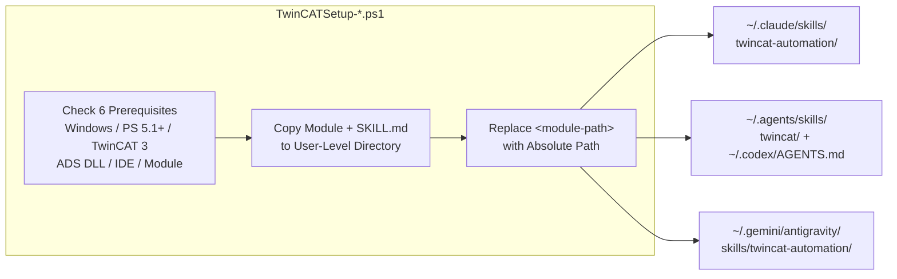
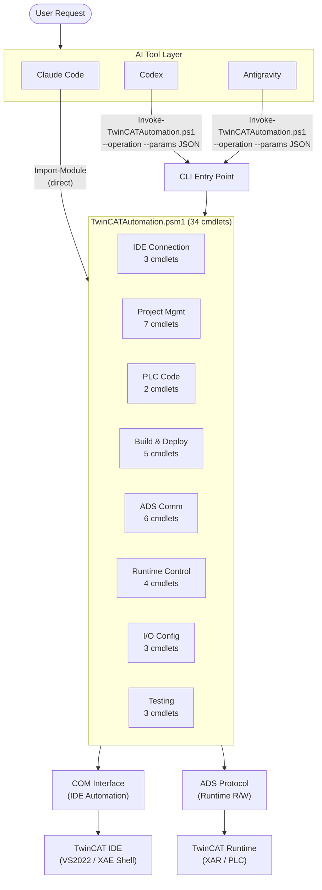
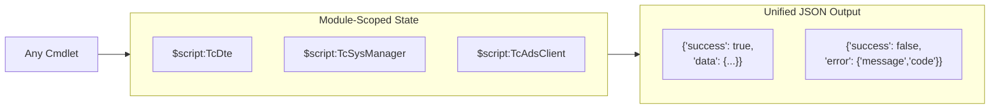
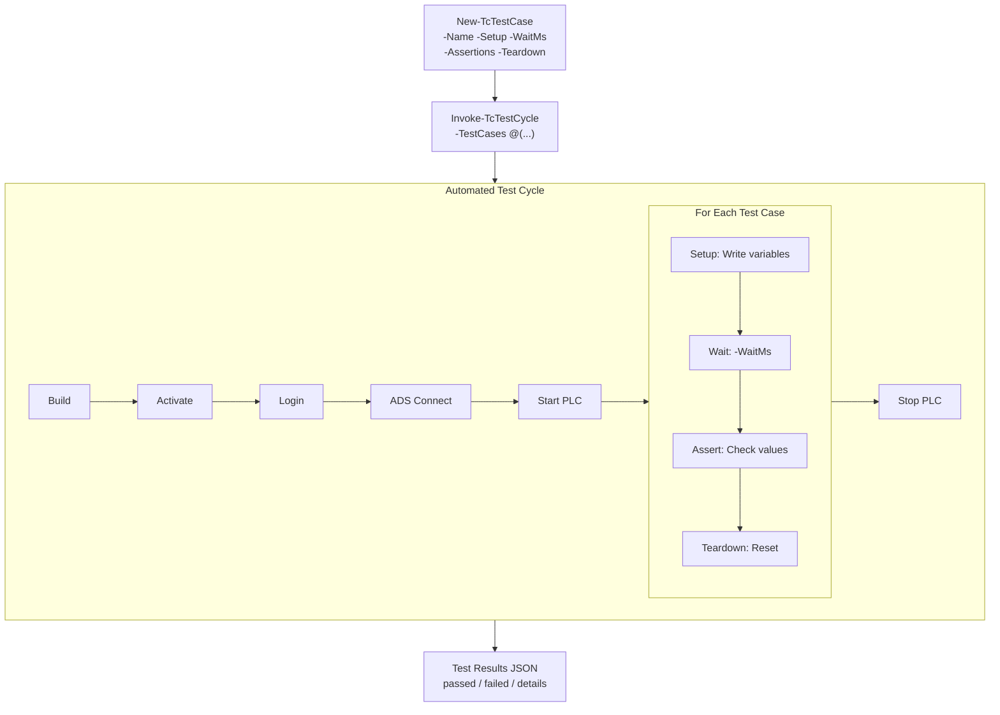

# TwinCAT-AutomationInterface Workflow

## 1. Installation Flow



## 2. AI Tool Integration



## 3. PLC Automation Lifecycle (Zero Dialogs)

```mermaid
flowchart TD
    START([Start]) --> S1

    S1["1. Connect-TcIde<br/>[-SolutionPath ...]"]
    S1 --> ROT

    subgraph ROT["IDE Discovery (ROT Enumeration)"]
        direction TB
        ENUM["Enumerate ALL DTE instances<br/>via Running Object Table<br/>(ComRotHelper.cs)"]
        MATCH{"Found matching<br/>solution?"}
        TC_PROJ{"Found IDE with<br/>TwinCAT project?"}
        FALLBACK["Fallback:<br/>GetActiveObject"]
        LAUNCH["Launch new IDE"]

        ENUM --> MATCH
        MATCH -->|Yes| REUSE([Reuse existing IDE])
        MATCH -->|No| TC_PROJ
        TC_PROJ -->|Yes| REUSE
        TC_PROJ -->|No| FALLBACK
        FALLBACK -->|Found| REUSE
        FALLBACK -->|Not found| LAUNCH
    end

    ROT --> S2["2. Build-TcProject<br/>(auto-retry RPC_E_CALL_REJECTED)"]
    S2 --> S3["3. Enable-TcConfig -Force<br/>(ADS WriteControl, no dialog)"]
    S3 --> S4["4. Start-Sleep 5s<br/>(wait XAR restart)"]
    S4 --> S5["5. Enter-TcPlcOnline<br/>(Login(3), no dialog)"]
    S5 --> S6["6. Connect-TcAds<br/>(AmsNetId auto-detected)"]

    S6 --> HELPER

    subgraph HELPER["TcAdsHelper Initialization"]
        direction TB
        TRY_CS["Try: Add-Type TcAdsHelper.cs<br/>+ TwinCAT.Ads.dll reference"]
        CS_OK{"Compiled?"}
        FB["Fallback: Reflection-based<br/>TcAdsHelper (no DLL reference)<br/>Works on PS 5.1 + PS 7"]

        TRY_CS --> CS_OK
        CS_OK -->|"Yes (PS 5.1)"| READY([TcAdsHelper Ready])
        CS_OK -->|"No (PS 7)"| FB --> READY
    end

    HELPER --> S7["7. Set-TcPlcState -State Run"]
    S7 --> S8

    subgraph S8["8. Variable Operations"]
        READ["Read-TcVariable<br/>-Path 'MAIN.nCounter'"]
        WRITE["Write-TcVariable<br/>-Path 'MAIN.bEnable' -Value $true"]
        SYMBOLS["Get-TcSymbols<br/>-Filter 'MAIN.*'"]
        WATCH["Watch-TcVariable<br/>-Condition {...}"]
    end

    S8 --> S9["9. Disconnect-TcAds<br/>Disconnect-TcIde"]
    S9 --> DONE([Done])

    style START fill:#4CAF50,color:#fff
    style DONE fill:#4CAF50,color:#fff
    style REUSE fill:#2196F3,color:#fff
    style READY fill:#2196F3,color:#fff
    style LAUNCH fill:#FF9800,color:#fff
```



## 4. Data Flow



## 5. Testing Workflow



## 6. AI-Driven Build-Fix-Test Loop

```mermaid
flowchart TD
    START([AI receives task:<br/>"Modify PLC code"]) --> EDIT

    EDIT["Write-TcPouCode<br/>Modify ST declaration / implementation"]
    EDIT --> BUILD["Build-TcProject"]
    BUILD --> CHECK_BUILD{"Build<br/>succeeded?"}

    CHECK_BUILD -->|"Yes (0 errors)"| DEPLOY
    CHECK_BUILD -->|"No (errors)"| PARSE

    subgraph FIX_LOOP["Auto-Fix Loop"]
        PARSE["Parse error messages<br/>from build result JSON"]
        ANALYZE["AI analyzes errors:<br/>- syntax errors<br/>- type mismatches<br/>- undeclared variables<br/>- missing semicolons"]
        PATCH["Write-TcPouCode<br/>Apply fix to declaration<br/>and/or implementation"]

        PARSE --> ANALYZE --> PATCH
    end

    PATCH --> REBUILD["Build-TcProject<br/>(retry)"]
    REBUILD --> CHECK_RETRY{"Build<br/>succeeded?"}
    CHECK_RETRY -->|"No (still errors)"| PARSE
    CHECK_RETRY -->|"Yes"| DEPLOY

    DEPLOY["Enable-TcConfig -Force<br/>Enter-TcPlcOnline<br/>Connect-TcAds<br/>Set-TcPlcState -State Run"]

    DEPLOY --> TEST

    subgraph TEST["Automated Testing"]
        WRITE_VAR["Write-TcVariable<br/>Set test inputs"]
        WAIT["Start-Sleep / Watch-TcVariable<br/>Wait for PLC processing"]
        READ_VAR["Read-TcVariable<br/>Read actual outputs"]
        ASSERT{"Assertions<br/>pass?"}

        WRITE_VAR --> WAIT --> READ_VAR --> ASSERT
    end

    ASSERT -->|"Yes"| DONE([All tests passed])
    ASSERT -->|"No"| DIAG

    subgraph DIAG["Diagnose & Retry"]
        READ_STATE["Read-TcVariable / Get-TcSymbols<br/>Inspect PLC state"]
        AI_FIX["AI analyzes failure:<br/>- wrong logic<br/>- timing issue<br/>- variable mapping"]
        RE_EDIT["Write-TcPouCode<br/>Fix logic"]

        READ_STATE --> AI_FIX --> RE_EDIT
    end

    RE_EDIT --> STOP_PLC["Set-TcPlcState -State Stop<br/>Exit-TcPlcOnline"]
    STOP_PLC --> BUILD

    style START fill:#4CAF50,color:#fff
    style DONE fill:#4CAF50,color:#fff
    style FIX_LOOP fill:#FFF3E0,stroke:#FF9800
    style TEST fill:#E3F2FD,stroke:#2196F3
    style DIAG fill:#FCE4EC,stroke:#E91E63
```
